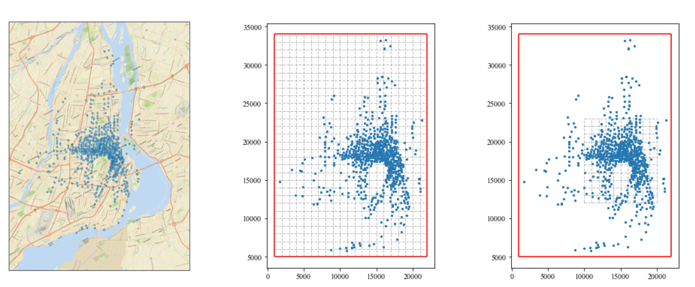
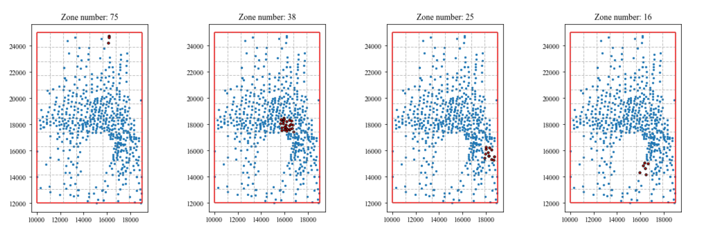

# Bixi-OD-Matrix-Prediction

## End-to-End Machine Learning Project 
Dynamic Origin-Destination (OD) matrix prediction for bike-sharing in Montreal based on dimensionality reduction and Deep Learning```
```
## Grid zone division for Bixi network in Montreal


## Zone examples:
76 zones in total 



